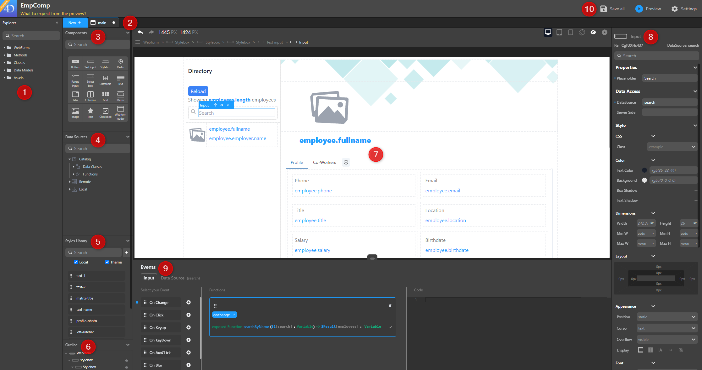
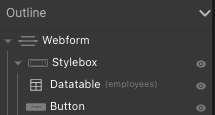

## Creating a webform

In 4D Web Studio, everything starts with a webform. A webform is a container that holds all the other components (buttons, grids, style boxes, etc.) of your application.

To create a webform:
* from the homepage, click **Webform** and enter a name for the new webform
* from the Webform Editor, click the **New +** tab > **Webform**

## Interface

The Webform Editor provides several tools to customize the interface and contents of your application:

<ol class="interface-numbers">
<li class="interface-item">Explorer: Lists your project's webforms, methods, classes, shared elements (such as images), and debuggger sessions. Use the **...** contextual menu at the right side of each element to access actions available for the element (usually **Delete**, **Duplicate**, **Open** or **Edit**). The Explorer also provides access to the project's definition files: roles and privileges, data model, and settings. </li>
<li class="interface-item">Tabs: They let you keep track of your currently opened elements, such as your forms and methods.</li>
<li class="interface-item">Components: The building blocks of your application.</li>
<li class="interface-item">Data Sources: Create and explore your datasources.</li>
<li class="interface-item">Styles Library: Holds predefined and customized styles for your components.</li>
<li class="interface-item">Outline: Presents the structure of your webform and allows you to navigate between the different elements. </li>
<li class="interface-item">Canvas: This is where you combine your components, styles and datasources. You can drag and drop components onto your canvas, then drag and drop CSS classes and datasources onto these components, and preview or render your webforms.</li>
<li class="interface-item">Properties panel: Allows for advanced style customization. Also allows binding datasources to components.</li>
<li class="interface-item">Contextual configuration panel: Link events and methods to your components, edit CSS styles, etc.</li>
<li class="interface-item-2"> Header: Save and preview your work, access the Data Explorer as well as additional settings.</li>
</ol>

### Breadcrumbs

When you select a component in the canvas, the breadcrumbs display its hierarchy:

To select any parent component displayed in the breadcrumbs trail, click its name. 

### Outline

The outline section displays the hierarchy of your webform:

Click an element in the list to select it, or click and drag it anywhere in the outline to move it somewhere else.

To display or hide an element, click the eye icon.

## Sanity check

The Webfom editor includes a **Sanity check** feature, allowing you to easily and quickly check the consistency of your Webforms. This tool is useful to avoid errors at runtime and save time. In particular, the sanity check will detect if a component is bound with a non existing datasource. 

The Sanity check is automatically enabled when an opened webform is being edited. Its icon is located at the upper right area above the canvas. When there are no errors, the icon looks like this:

When errors have been detected, the number of errors is displayed on the icon and you can click on it to display more information about the error(s):

:::note

The Sanity check is only informative. A webform can always be saved even if it contains errors. 

:::